# EX 2 Data Manipulation Language (DML) Commands and built in functions in SQL
## AIM:
To create a manager database and execute DML queries using SQL.


## DML(Data Manipulation Language)
<div align="justify">
The SQL commands that deal with the manipulation of data present in the database belong to DML or Data Manipulation Language and this includes most of the SQL statements. It is the component of the SQL statement that controls access to data and to the database. Basically, DCL statements are grouped with DML statements.
</div>

## List of DML commands: 
<div align="justify">
INSERT: It is used to insert data into a table.<br>
UPDATE: It is used to update existing data within a table.<br>
DELETE: It is used to delete records from a database table.<br>
</div>

## Create the table as given below:
```sql
create table manager(enumber number(6),ename char(15),salary number(5),commission number(4),annualsalary number(7),Hiredate date,designation char(10),deptno number(2),reporting char(10));
```
## insert the following values into the table
```sql
insert into manager values(7369,'Dharsan',2500,500,30000,'30-June-81','clerk',10,'John');
insert into manager values(7839,'Subu',3000,400,36000,'1-Jul-82','manager',null,'James');
insert into manager values(7934,'Aadhi',3500,300,42000,'1-May-82','manager',30,NULL);
insert into manager values(7788,'Vikash',4000,0,48000,'12-Aug-82','clerk',50,'Bond');
```

### Q1) Update all the records of manager table by increasing 10% of their salary as bonus.

### QUERY:
```
UPDATE manager SET salary = salary * 1.10;
```
### OUTPUT:

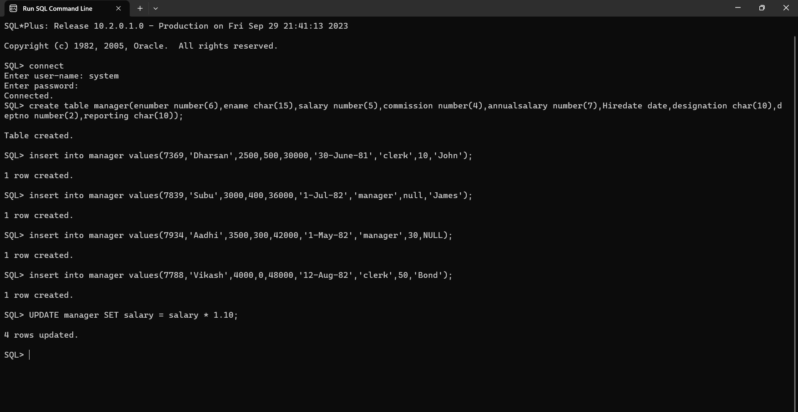

### Q2) Delete the records from manager table where the salary less than 2750.


### QUERY:
```
DELETE FROM manager WHERE salary < 2750;
```
### OUTPUT:

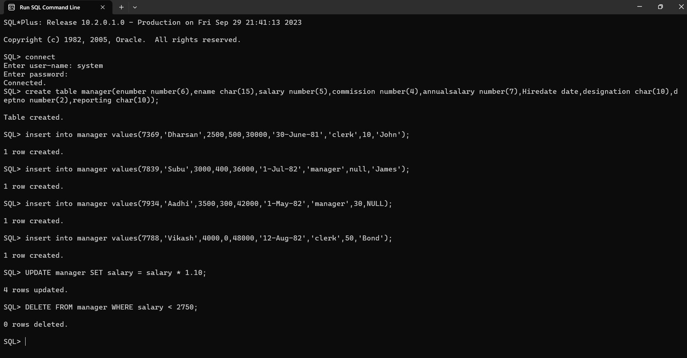

### Q3) Display each name of the employee as “Name” and annual salary as “Annual Salary” (Note: Salary in MANAGER table is the monthly salary)


### QUERY:
```
SELECT ename AS "Name", (salary * 12) + NVL(commission, 0) AS "Annual Salary" FROM manager;
```
### OUTPUT:

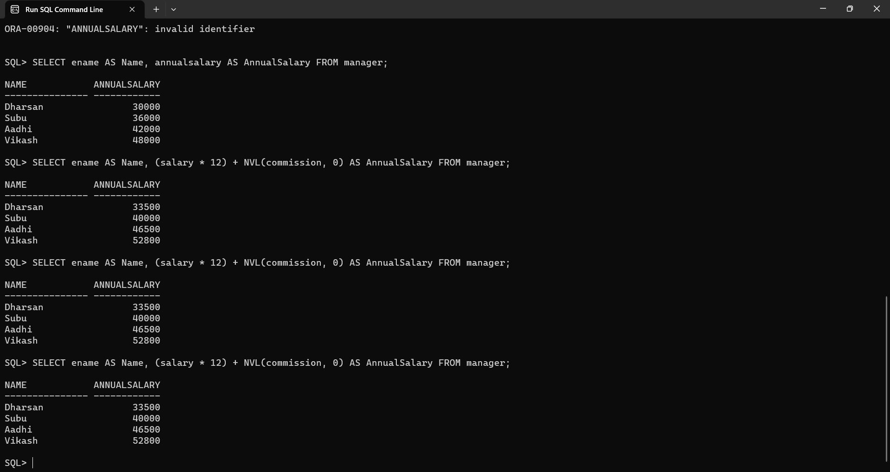

### Q4)	List the names of Clerks from MANAGER table.


### QUERY:
```
SELECT ename FROM manager WHERE designation = 'clerk';
```
### OUTPUT:

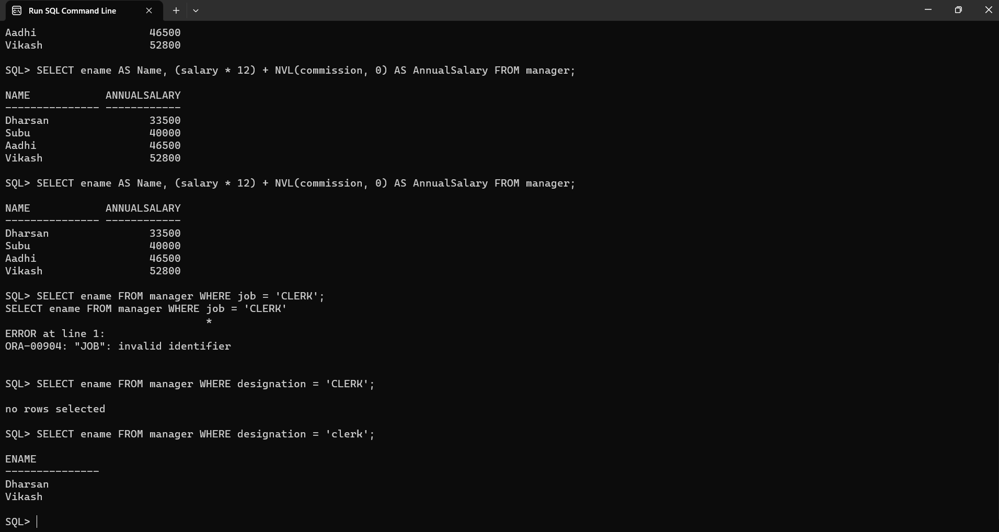

### Q5)	List the names of employee who are not Managers.


### QUERY:
```
SELECT ename FROM manager WHERE designation != 'manager';
```
### OUTPUT:


### Q6)	List the names of employees not eligible for commission.


### QUERY:
```
SELECT ename FROM manager WHERE commission = 0;
```
### OUTPUT:

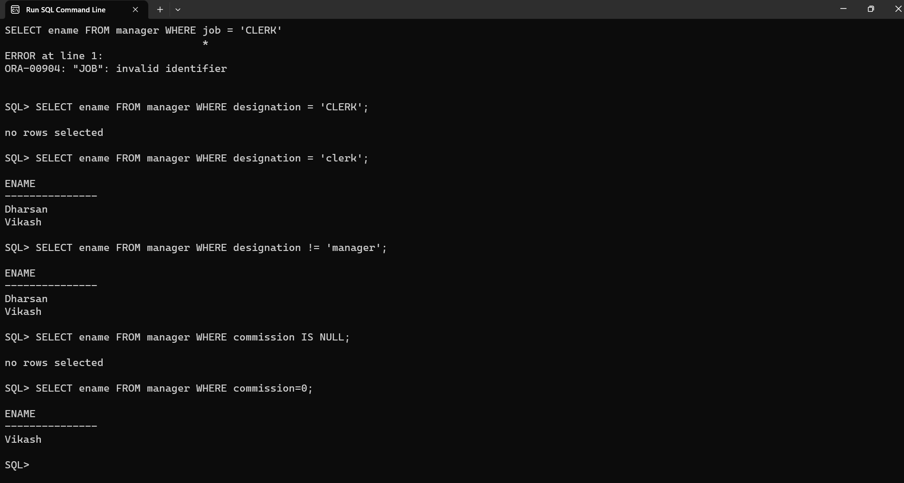

### Q7)	List employees whose name either start or end with ‘s’.


### QUERY:
```
SELECT ename FROM manager WHERE ename LIKE 'S%' OR ename LIKE '%S';
```
### OUTPUT:


### Q8) Sort MANAGER table in ascending order by hire-date and list ename, job, deptno and hire-date.


### QUERY:
```
SELECT ename, designation, deptno, Hiredate FROM manager ORDER BY hiredate ASC;
```
### OUTPUT:

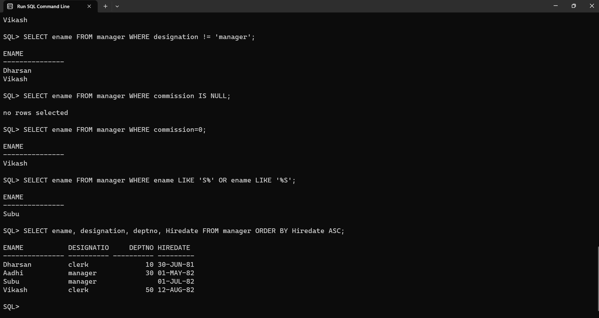

### Q9) List the Details of Employees who have joined before 30 Sept 81.


### QUERY:
```
SELECT * FROM manager WHERE Hiredate < TO_DATE('30-SEP-81', 'DD-MON-YY');
```
### OUTPUT:

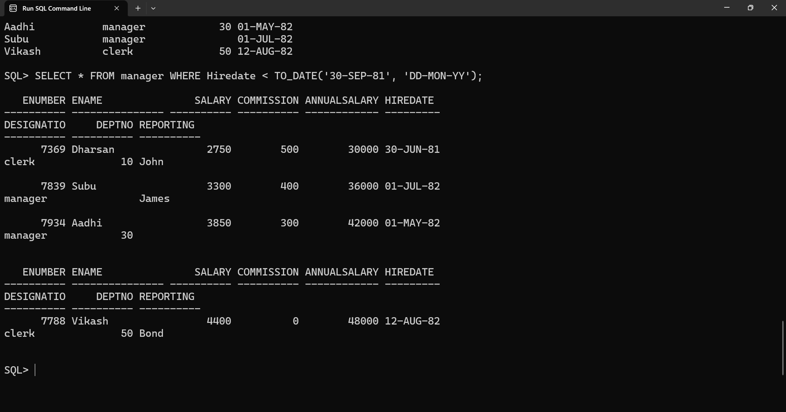

### Q10)	List ename, deptno and sal after sorting emp table in ascending order by deptno and then descending order by sal.


### QUERY:
```
SELECT ename, deptno, salary FROM manager ORDER BY deptno ASC, salary DESC;
```
### OUTPUT:

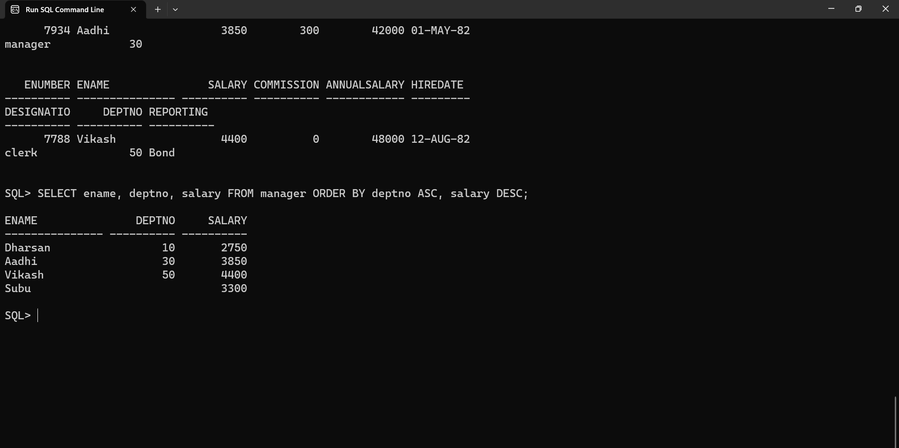

### Q11) List the names of employees not belonging to dept no 30,40 & 10


### QUERY:
```
SELECT ename FROM manager WHERE deptno NOT IN (10, 30, 40);
```
### OUTPUT:

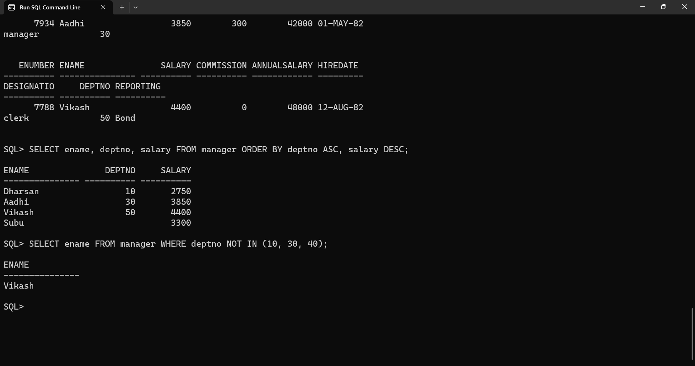

### Q12) Find number of rows in the table MANAGER.

### QUERY:
```
SELECT COUNT(*) AS "Number of Rows" FROM manager;
```
### OUTPUT:

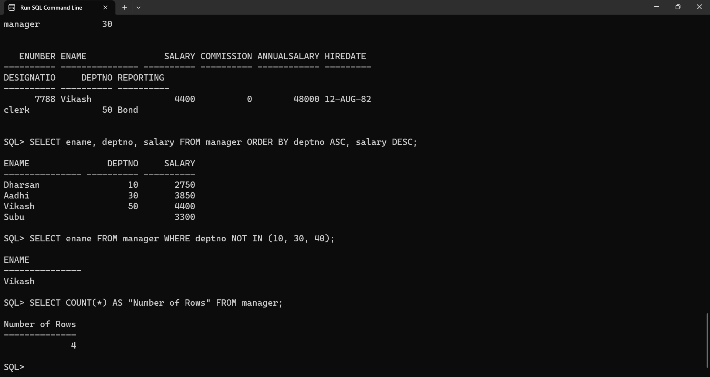

### Q13) Find maximum, minimum and average salary in MANAGER table.

### QUERY:
```
SELECT MAX(salary) AS "Maximum Salary", MIN(salary) AS "Minimum Salary", AVG(salary) AS "Average Salary" FROM manager;
```
### OUTPUT:

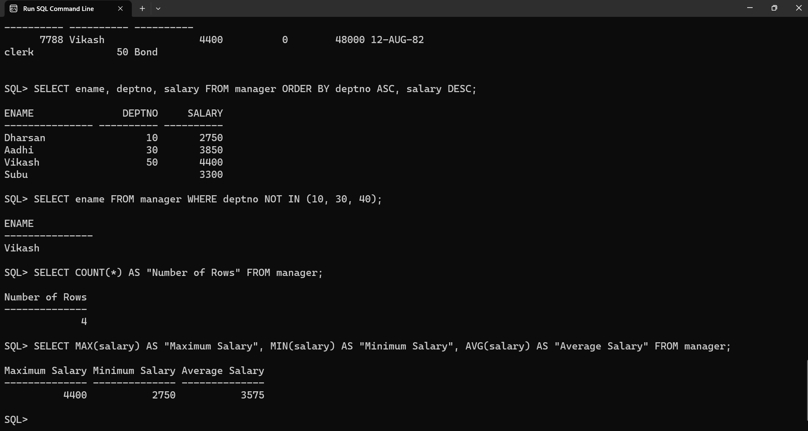

### Q14) List the jobs and number of employees in each job. The result should be in the descending order of the number of employees.

### QUERY:
```
SELECT designation, COUNT(*) AS "Number of Employees" FROM manager GROUP BY designation ORDER BY COUNT(*) DESC;
```
### OUTPUT:

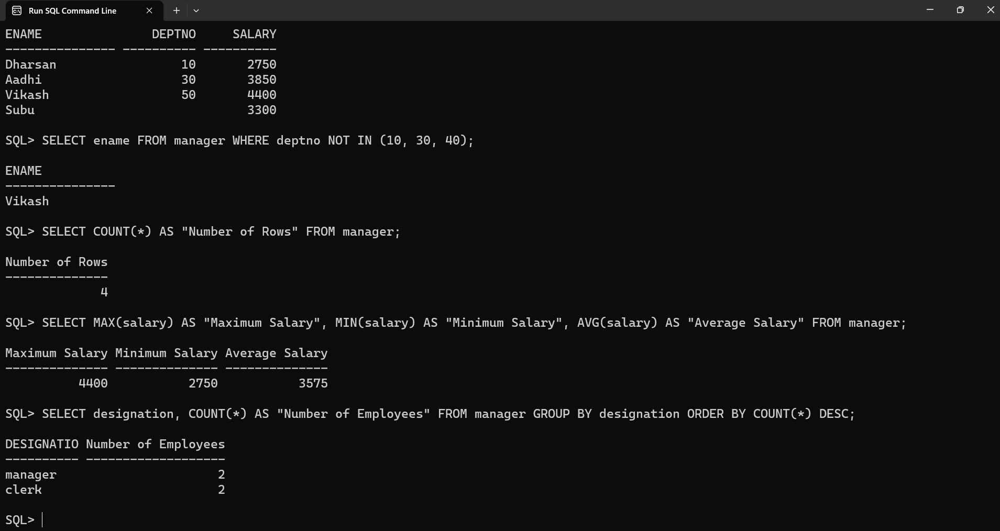
